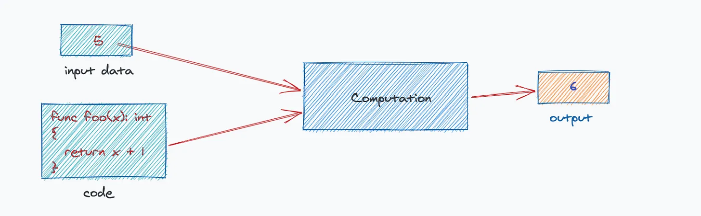
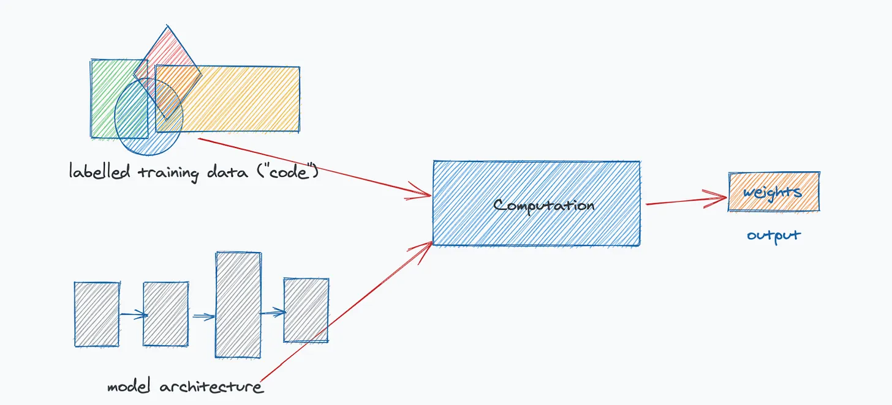

# Productionizing an ML Pipeline

### Background

Machine Learning (ML) is the process of taking a dataset and sample output as inputs and allowing a computer to generate a program that will do predict similar outputs on future inputs. The core ideas are:

- The past can predict the future, so historical data is relevant to future data.
- Programs can generate output by looking at examples, rather than having to explicitly encode instruction on how to reach an output.



(source: https://karimfanous.substack.com/p/software-20-vs-software-10)

Once a model is created using historical data, we also may want to continually retrain the model for various reasons:

- availability of more data/examples
- distribution shift from production data
- issues with serving the model (latency, CPU/memory requirements, etc)

With this continuous retraining, we also need to be mindful of how the performance improves or degrades over each training run. As a result, we need to instrument the pipeline with metrics and collect that data so it can be used for manual/automating decision making of whether to ship new versions of the model.


### Summary

We will develop a pipeline that ingests some historical data (signals + answers) and trains an algorithm to make predictions on unseen examples. 

This tutorial will walk through using the [Fashion-MNIST](https://github.com/zalandoresearch/fashion-mnist) dataset, which is a publically available dataset on 70,000 total examples of clothing images.


(source: https://github.com/zalandoresearch/fashion-mnist)

We will utilize the following technologies/tools:

- Python
- Pytorch (ML library)
- Apache Airflow (pipeline orchestration)
- Matplotlib (data visualizations)
- AWS S3 (cloud object storage)
- StatD Exporter (metrics exporter which exposes metrics from network daemon)
- Prometheus (metrics collection infrastructure)

### Goals

1) Build a simple ML pipeline in Python using Pytorch
2) Add orchestration via Airflow to the tasks within the ML pipeline to run it on a schedule
3) Instrument/observe metrics on the pipeline to make improvements and decide whether to ship new model versions

At the end of this workshop, you should have a better understanding of ML, MLOps, and observability. These concepts will hopefully enable you to  productionize your ML projects.

### Steps

#### 1) Ingestion

The first step is to ingest the dataset we are going to use. This involves both the raw input, as well as labels that are associated with each data point. In our case, the raw input is the 70,000 28x28 grayscale images from the Fashion-MNIST dataset. The labels are the 10 classes that exist for these examples (i.e. 't-shirt', 'coat', etc.) that each example is classified with.

We will also perform any operations on the dataset to prepare it for training. This will include generating Tensors (multi-dimensional matrix) that are used in Pytorch and creating batches of training samples.

We need to split our dataset into 2 subsets

- Training + Validation data (used as examples to train the model and validate performance during training)
- Test data (used to measure model performance **after** training)

At the conclusion of this stage, we will upload the datasets to S3 object storage so it can be loaded/used in subsequent steps in our pipeline.

#### 2) Training

The second step involves loading the training data stored in S3 into the train task and doing multiple runs over the data (epochs) while training our model. In this case, we utilize a Neural Network (NN) with a loss function of cross entropy loss and an optimizer of stochastic gradient descent (SGD). This network has multiple layers, with ReLU operators in between each layer of nodes. The model is reduced to 10 dimensions at the end of the network to map to the 10 classes we have for clothing (i.e. t-shift, sandals, etc.)

The final result of the stage involves generating a model that is uploaded to S3 for consumption in the final stage of the pipeline.

#### 3) Testing

The final stage of the pipeline involves consuming the test data and model uploaded to S3 from stages 1 + 2, respectively. The test data is fed through the model and an overall accuracy metric is generated. We will also look at some examples to see how the model predicts the class of the images.

In addition to printing the accuracy metrics, this stage instruments the accuracy metric so that is can be exported by StatsD-Exporter and ultimately scraped by Prometheus.

### Orchestration

We will stitch together the steps of our pipeline into a DAG (directed ascyclic graph) using Airflow. Airflow will run the steps either synchronously or in parallel (based on the dependency flow we describe).

### Observability

We will instrument/collect metrics from our Airflow pipeline via Prometheus so that we can inspect how our model and pipeline is performing on each training run. These metrics are sent to StatsD, are network daemon that runs in the background and listens for various instrumented metrics. StatsD will forward the metrics to a metrics exporter (statsd-exporter), which will be scraped by Prometheus to collect the metrics on a consistent interval.

### Setup

#### 1) Airflow installation

**Docker Containers**

Airflow can be [run](https://airflow.apache.org/docs/apache-airflow/stable/howto/docker-compose/index.html) as a set of Docker containers. These containers are:

- airflow-scheduler: monitors tasks and DAGs, triggers tasks once dependencies are complete
- airflow-webserver: lists DAGs, runs, history, other important data
- airflow-worker: executes tasks given by the scheduler
- airflow-triggerer: runs an event loop for deferrable tasks
- airflow-init: initialization service
- postgres: the PostgreSQL database
- redis: redis broker that passes messages from the scheduler to workers

- Fetch Docker compose file
    - `curl -LfO 'https://airflow.apache.org/docs/apache-airflow/2.7.1/docker-compose.yaml'`
- Initalize the database
    - `docker compose up airflow-init`
- Build dependencies
    - `docker compose build`
- Run Airflow
    - `docker compose up`

Additional dependencies (Pytorch, etc.) are managed by `requirements.txt`, which specifies in the `x-airflow-common` container the common dependencies to be installed.

#### 2) Enable StatsD metrics

In `airflow.cfg`, set `statsd_on` to `True`.

```
# Enables sending metrics to StatsD.
statsd_on = True
statsd_host = localhost
statsd_port = 8125
statsd_prefix = airflow
```

#### 3) Start Airflow

Run `airflow webserver`, navigate to `localhost:8080` in the browser.
Run `airflow scheduler`.

### Alternatives

### Discussion